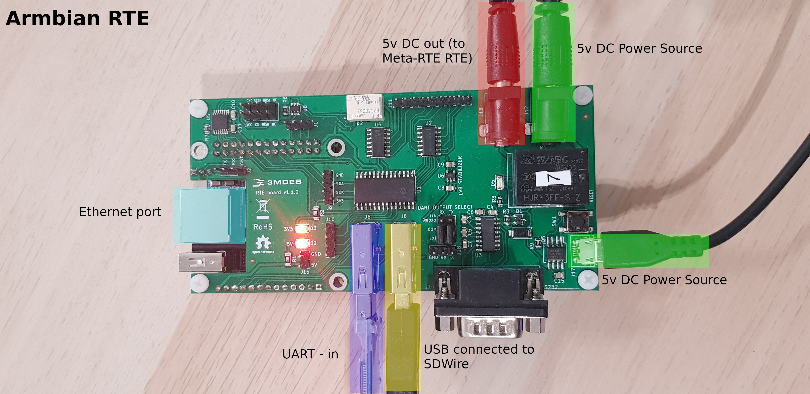
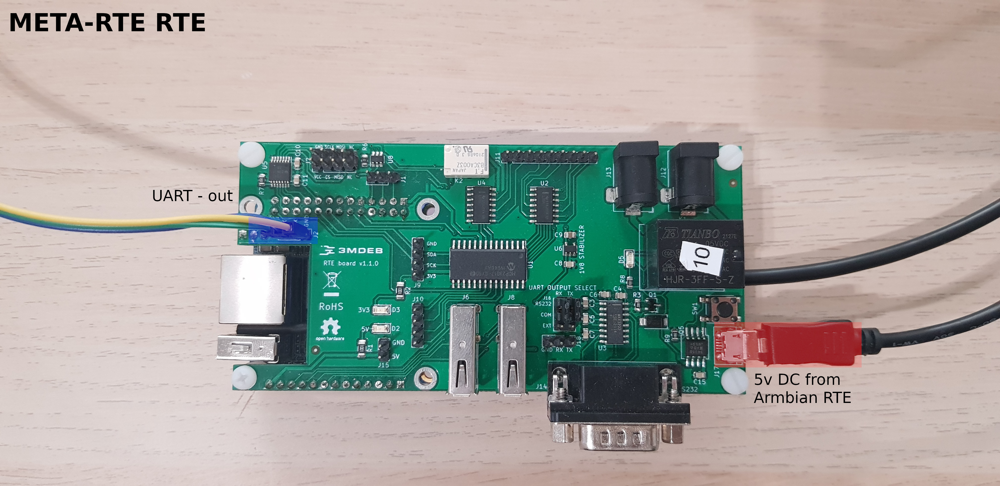
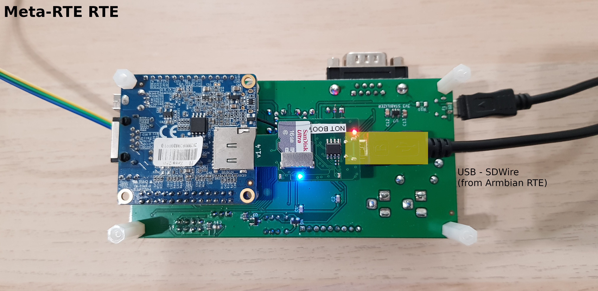

# SD Wire test stand documentation

The following documentation describes the method of construction of the test
stand dedicated to the validation of newly SDwire(s).

It contains information about:
* which elements are necessary to build the stand,
* how to prepare all elements of the test stand,
* how to connect all of the elements of the test stand.

This documentation should be used in one of two situations:
* by testing persons, to familiarize themselves with the test stand
    construction,
* by members of the TA Team (or other delegated people) to improve and/or
    construct other test stands.

## Prerequisites

1. **2x** [RTE HAT with Orange Pi Zero and SD card](https://3mdeb.com/shop/open-source-hardware/open-source-hardware-3mdeb/rte/)
1. RJ45 Ethernet cable.
1. 5V 2A micro USB power supply for RTE board.
1. 5V 2A DC-jack power supply for RTE board.
1. DC-jack (male) - DC-jack (male) connector.
1. Micro-USB --> USB cable
1. UART/USB converter or RS232 null modem cable (or 3/5 jumper wires).

> Note: in the equipment of the test stand the tested device (SDWire) is
    not included.

## RTE - Test Server setup

The following section of the documentation describes the method of configuring
RTE that has been used as the Test Server.

### Required elements

1. [RTE HAT with Orange Pi Zero and SD card](https://3mdeb.com/shop/open-source-hardware/open-source-hardware-3mdeb/rte/)
1. 5V 2A micro USB power supply for board.
1. RJ45 Ethernet cable (to connect the device to the local network).
1. UART/USB converter (or RS232 null modem cable or 3/5 jumper wires).

### Preparing an image for the device

1. Download the latest meta-rte version from the
   [the cloud](https://cloud.3mdeb.com/index.php/f/607222).
2. Flash the SD card using `bmaptool` or `balenaEtcher`.
    * to do this by `balenaEtcher` go to the [producer site][balena]
    and follow his procedure on how to download and flash the SD card
    * to do this by `bmaptool` reproduce the following steps:
        - install bmaptool by opening the terminal and typing the following
            command:

            ```bash
            sudo apt install bmap-tools
            ```

        - create the bmap by typing the following command:

            ```bash
            bmaptool create /path/to/your/image > /path/where/you/want/bmap/file/saved/bmapfilename.bmap
            ```

        - flash image to the SD card by typing the following command:

            ```bash
            sudo bmaptool copy --bmap ~/path/where/your/bmap/file/is/located /path/where/your/image/is/located /path/to/memory/device
            ```
3. Expand the `/data` partition to 2GB.
4. Save the `core-image-minimal-orange-pi-zero-v0.7.4-rc4.wic.bmap` and
   `core-image-minimal-orange-pi-zero-v0.7.4-rc4.wic.gz`
   to `/data`.

### RTE Test Server setup

1. Insert Orange Pi into RTE.
1. Insert SD card into Orange Pi.
1. Connect the ethernet cable to Orange Pi.
1. Connect the EXT UART J18 header pins with DUT [RTE J2 Header](../specification/#uart0-header).

    | RTE UART J18  | RTE J2 Header|
    |:-------------:|:------------:|
    | GND           | GND          |
    | TX            | RX           |
    | RX            | TX           |

2. Open the serial connection with RTE from your PC using a previously connected
    USB-UART converter by executing the following command:

    ```bash
    sudo minicom -D /dev/ttyUSB<x>
    ```

    > Substitute `<x>` with the device number corresponding to your USB-UART
    > Converter for example `/dev/ttyUSB0`. The `dmesg` command allows for
    > identifying the latest connected devices.

3. Plug the power supply into the RTE J17 Micro-USB slot.
4. Login into the device by using the default credentials:
    - Login: `root`
    - Password: `meta-rte`

5. Execute the following command to see if the IP address is correct:

    ```bash
    ip a
    ```

    The output of the above command should look as follows:

    ```bash
    3: eth0: <BROADCAST,MULTICAST,UP,LOWER_UP> mtu 1500 qdisc mq state UP group default qlen 1000
    link/ether 02:42:66:21:f7:ea brd ff:ff:ff:ff:ff:ff
    inet 192.168.4.XXX/24 brd 192.168.10.255 scope global dynamic eth0
       valid_lft 595628sec preferred_lft 595628sec
    inet6 fe80::42:66ff:fe21:f7ea/64 scope link 
       valid_lft forever preferred_lft forever
    ```

6. Check the correctness of the connection to the Internet by executing the
    following command:

    ```bash
    ping google.com
    ```

    The output of the above command should look as follows:

    ```bash
    PING google.com (216.58.209.14) 56(84) bytes of data.
    64 bytes from waw02s18-in-f14.1e100.net (216.58.209.14): icmp_seq=1 ttl=55 time=19.5 ms
    ```

7.  Submit the address reservation requests for the device to `Amado`.
8.  Log out from RTE by closing the minicom connection.

## RTE - Device Under Test setup

The following section of the documentation describes the method of configuring
RTE that has been used as the Device Under Test.

### Required elements

1. [RTE HAT with Orange Pi Zero and SD card](https://3mdeb.com/shop/open-source-hardware/open-source-hardware-3mdeb/rte/)
1. 5V 2A micro USB power supply for board.
1. UART/USB converter (or RS232 null modem cable or 3/5 jumper wires).

### Preparing device

Prepare the device according to the
[documentation](https://docs.dasharo.com/transparent-validation/rte/v1.1.0/quick-start-guide/#preparation-of-rte)

## Combining and finalizing the setup

1. Make connections on Test Server RTE according to below the image:

    

2. Connect the Ethernet cable from the switch/modem to the Ethernet port
    (CYAN on the image above).

3. Make connections on DUT RTE according to the below images:

    
    

4. The setup should be fully functional from now on.
